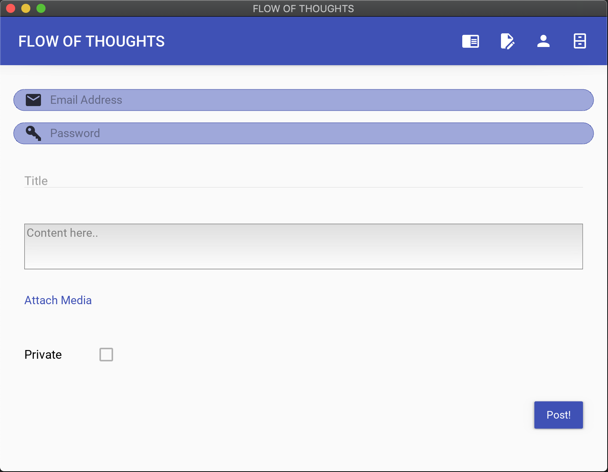

# Blogging Application

A python3-based cross-platform blogging application built using Kivy framework and KivyMD widgets.


## Features
* Register new user
* Create new posts (public/private)
* View posts
  * Public - Accessible by everyone
  * Private - Accessible by creator only
* Attach file to the posts
* Delete posts (admin only)
* View activity log (admin only)
  * Date & Time
  * Activity Type
  * User
  * IP Address
  * Location
  * Browser




## Usage
1. Setup python virtual environment using [pyenv](https://github.com/pyenv/pyenv) (in the project directory)
   ``` 
   pyenv install 3.7.7
   pyenv virtualenv 3.7.7 blogging-application
   pyenv local blogging-application
   ```
2. Install dependencies
   ```
   pip3 install -r requirements.txt
   ```
3. Run application
   ```
   python3 main.py
   ```
   ---
   
   :iphone: Use [Buildozer](https://github.com/kivy/buildozer) to deploy for Android and iOS.
   
   :file_cabinet: An SQLite database (blog.db) will be created in the root directory during the first run.

   :key: **Default credentials** { Email Address: `admin@fot.com` Password: `Admin@2020` }
